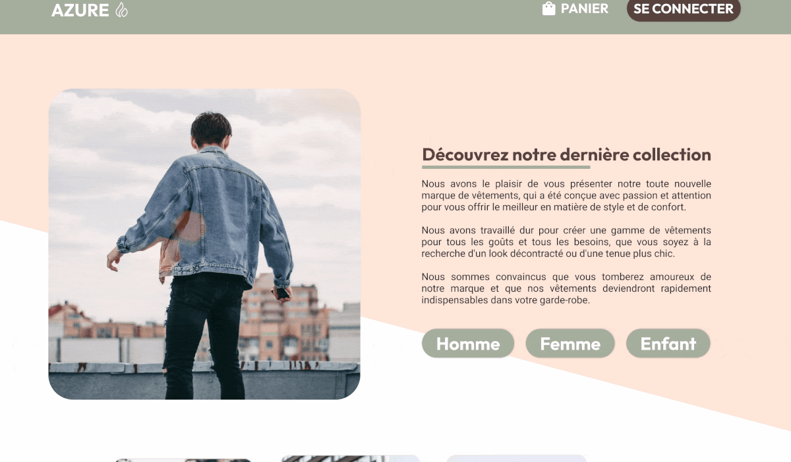
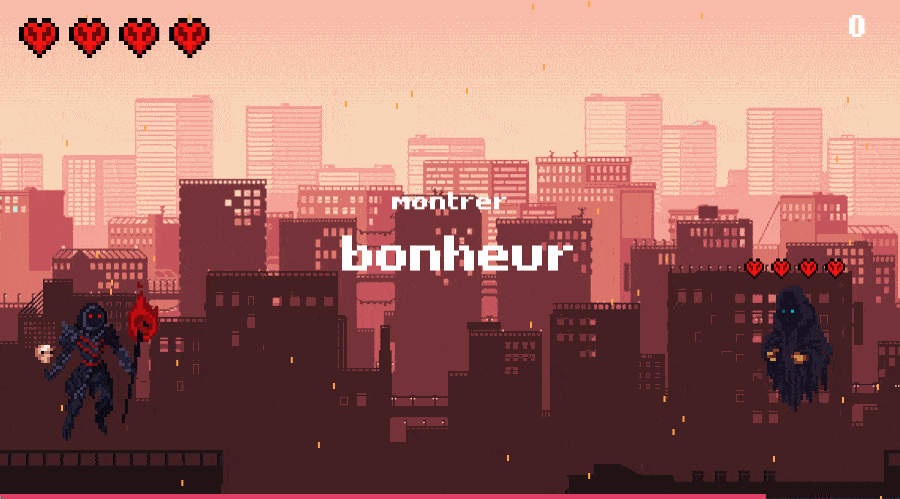

## 📝 Développeur Web et Mobile, Recherche d'Alternance

Rémi VIDAL-MICHEL, 24 ans. J'ai commencé à m'intéresser au **développement web** en intégrant l'école La Plateforme. J'ai depuis acquis de solides compétences en HTML, CSS, Python, PHP et JavaScript. J'aime m'intégrer dans une équipe et participer à des projets, mais je suis également autonome.
Je suis actuellement à la recherche d'une **alternance** pour la rentrée de Septembre/Octobre 2023.

## 👨‍💻 Les langages que je maîtrise : 

## 🛠️ Les outils que je maîtrise : 

## 🚀 Mes projets :

* [Design d'une boutique en ligne sur Figma](https://github.com/remi-vidal-michel/Figma "Projet Figma")
* [Typing Game en Python](https://github.com/remi-vidal-michel/typinggame "Typing Game")

## 🔜 Projet en cours :

* Boutique en ligne Fullstack.

## 📫 Vous pouvez me contacter par :

* [LinkedIn](https://www.linkedin.com/in/r%C3%A9mi-vidal-michel-a4b3ba271/ "LinkedIn de Rémi Vidal-Michel")
* [remi.vidal-michel@laplateforme.io](mailto:remi.vidal-michel@laplateforme.io "Mail à Rémi Vidal-Michel")

Merci de votre visite !
